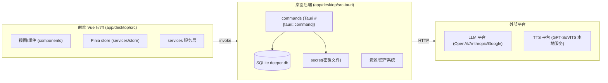
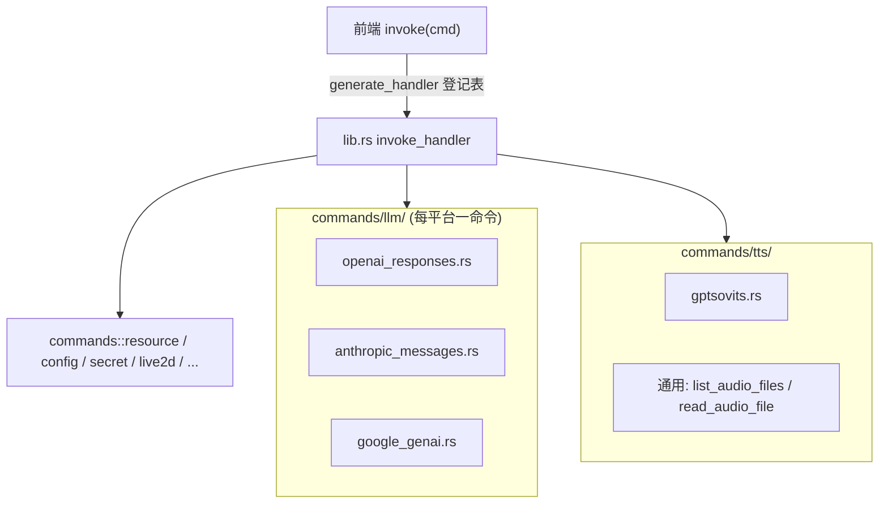
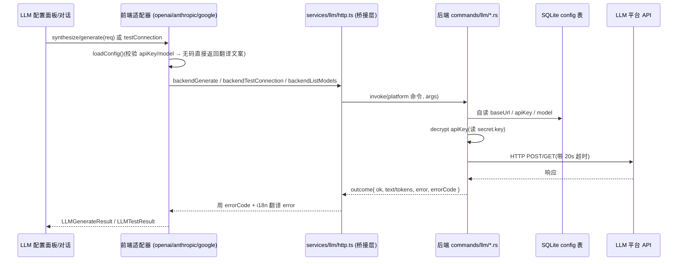
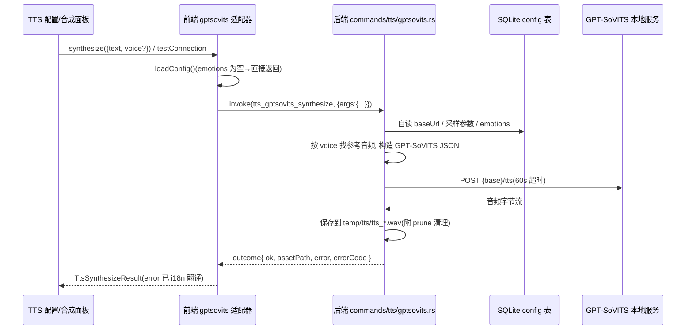
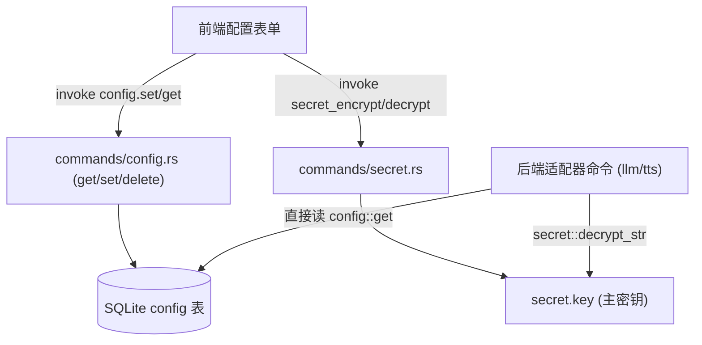
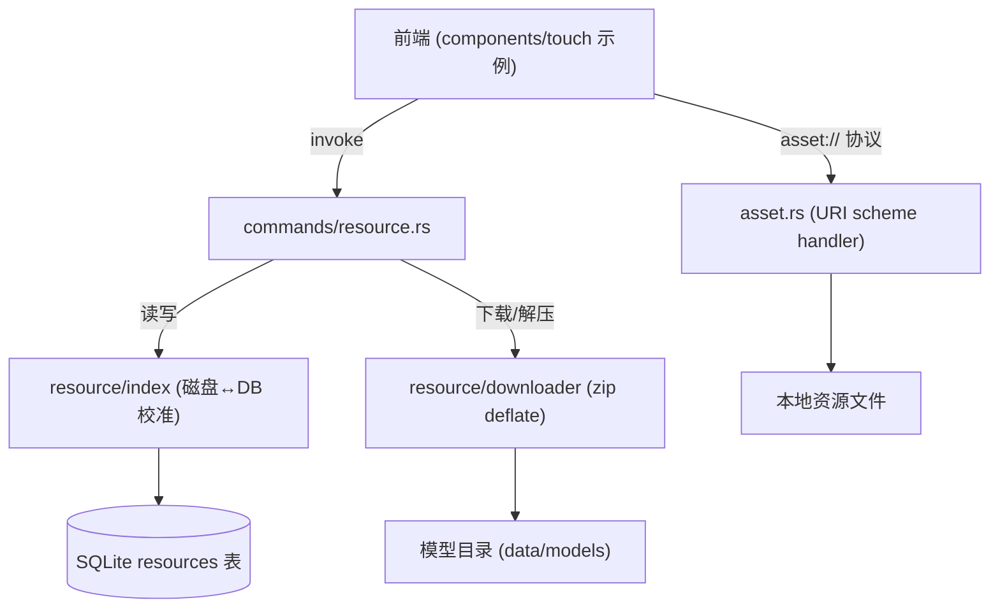
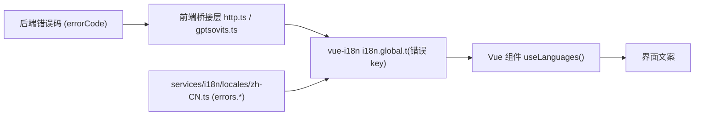

# 架构

> DeepEr 整体架构说明. 以模块为单位, 一个模块一张运行线路图(mermaid), 供后续 Agent 汇总与扩展参考. 
>
> 关键约定: **LLM / TTS 采用"前端适配器 = 平台选择薄层, 后端适配器 = 协议实现"**, 协议构造 / 鉴权 / 请求 / 响应解析全部下沉到后端, 后端自数据库读取配置并解密, apiKey 不往返前端. 

## 目录

- [架构](#架构)
  - [目录](#目录)
  - [模块总览](#模块总览)
  - [1. Tauri 命令注册](#1-tauri-命令注册)
  - [2. LLM 适配器运行线路](#2-llm-适配器运行线路)
  - [3. TTS 适配器运行线路](#3-tts-适配器运行线路)
  - [4. 配置与密钥存储链路](#4-配置与密钥存储链路)
  - [5. 资源 / 资产系统](#5-资源--资产系统)
  - [6. i18n 国际化](#6-i18n-国际化)

---

## 模块总览

```
monorepo
├─ app/desktop   Vue3 + TypeScript 前端 + Tauri(Rust) 桌面后端
│  ├─ src/                 前端 Vue 应用
│  ├─ src-tauri/           Rust 后端(Tauri commands + SQLite + 资源管理)
│  └─ platform/ (android)  Android 客户端
├─ backend/      Go REST API 服务器(独立服务, 供外部客户端调用)
└─ docs/         架构 / 规范 / 权限等文档
```



---

## 1. Tauri 命令注册

`src-tauri/src/lib.rs` 的 `invoke_handler` 是前端唯一可调用后端命令的入口表. `commands/` 下按业务域拆分子模块, 其中 `llm/` 与 `tts/` 为适配器实现层. 



- 命令名与 Rust 函数一一对应. 带结构体参数的命令, 前端需以**参数名作为一级 key**(如 `args: { ... }`), 而非平铺字段__否则报 `missing required key`. 
- 管理器参数(`AppHandle`/`State<Db>`)由 Tauri 自动注入, 前端无需传. 

---

## 2. LLM 适配器运行线路

前端 `services/llm/adapters.ts` 持有 3 个平台适配器实例; `useLLMStore` 是统一入口. 适配器只做: 平台配置读写(UI 展示)/按平台调用对应后端命令/把后端错误码翻译为 i18n 文案. 协议构造全部在**后端**. 



**错误码机制(后端→前端 i18n)**: 后端失败时返回 `errorCode`(如 `missing_api_key`/`missing_model`/`network_error`/`http_error`), 前端 `http.ts` 查到对应 i18n key 翻译; `http_error` 额外带 `status` 插值. 

---

## 3. TTS 适配器运行线路

与 LLM 同构. 前端 `services/tts/gptsovits.ts` 只负责配置读写与调用后端命令; 后端 `commands/tts/gptsovits.rs` 自读配置(含 emotions 参考音频列表)并请求 GPT-SoVITS 本地服务, 产物保存在 `temp/tts/` 供前端经 asset 协议播放. 



- 通用工具 `tts_list_audio_files` / `tts_read_audio_file` 由前端直接调用做参考音频扫描/预览, 与平台无关. 
- TTS 错误码: `empty_text`/`missing_voice`/`network_error`/`http_error`/`empty_audio`. 

---

## 4. 配置与密钥存储链路

所有配置统一存 SQLite `deeper.db` 的 `config` 表(key-value JSON). API Key 使用 AES-256-GCM 加密, 主密钥在应用数据目录 `secret.key` 中. 



- 配置读写命令由前端调用(UI 需要展示); 但**请求执行时**后端命令直接从 DB 读密文并解密, apiKey 明文不往返前端. 
- 配置键前缀与前端 `services/llm/*.ts`/`services/tts/gptsovits.ts` 中的 `PREFIX` 保持一致(如 `llm_openai_responses_*`/`tts_gpt_sovits_*`). 

#### 上下文 (contexts 表) 与 AI 链路

- `contexts` 表是对话/人设上下文的唯一事实源, 记录类型: `person` (当前人设, system 消息) / `talk` (对话) / `touch` (触摸) / `tts` (合成记录). 设为人设 (`persona_select`) 时后端自动写入 type=person 记录, 切换/清除时替换.
- 每条记录可带 `token_count` (估算) 与真实 `input_tokens` / `output_tokens` (LLM 返回), AI 回复记录还带 `hit_rate` (上下文命中率 = 本次请求实际使用的上下文 token / 库中上下文 token).
- 前端 `services/store/conversation.ts` 是 AI 统一入口: 构建上下文 → LLM 流式生成 → 记录真实 token 与命中率 → TTS 朗读 (`useTTSStore().speak` 统一处理 md 清洗 / AI 调参 / 记录). 已移除 Markdown 分词器, 流式直接整段渲染; 后续 MCP / 技能 / 工具扩展 `buildTalkMessages` 的上下文类型即可.

#### 适配器配置读写收敛

`services/llm/platform.ts` 提供平台公共配置工具(`loadPlatformBase`/`savePlatformBase`/`hasPlatformApiKey`/`clearPlatformApiKey`/`normalizeBaseUrl`/`validatePlatformConfig`), 三个 LLM 适配器只保留各自的扩展字段(如 OpenAI 的 `reasoningEffort`); 桥接层 `services/llm/http.ts` 按适配器的 `platform` 字段查命令表, 适配器与 store 不再各自维护命令名映射.

---

## 5. 资源 / 资产系统

负责 Live2D 模型/下载资源与本地文件资产(`asset://` 协议)的管理. 



---

## 6. i18n 国际化

界面文案全部走 `vue-i18n`; 服务层与后端返回**错误码**, 由前端在收到后翻译, 后端不返回界面文案(避免双语耦合). 



- 新增译文: `common.*` / `components.main.llm.*` / `components.main.tts.*` / `errors.*`. 
- `en-US.ts` 目前为空, 未配置的 locale 会 fallback 到 `zh-CN`. 
- 通用文案(保存/取消/删除/加载中/连接状态/保存并离开等)收敛到 `common.*` 公共组; 组件用 `useLangGroups({...})` 一次引用多个语言组(见 `services/i18n/useLanguages.ts`). 语言快照按 locale 记忆化.

---

> 给后续 Agent 的备注: 本文件随代码演进更新; 新增适配器时同步补 `commands/<域>/<平台>.rs`/前端 `services/<域>/<平台>.ts`/错误码与 `errors.*` 译文, 并在此补一张运行线路图. 
